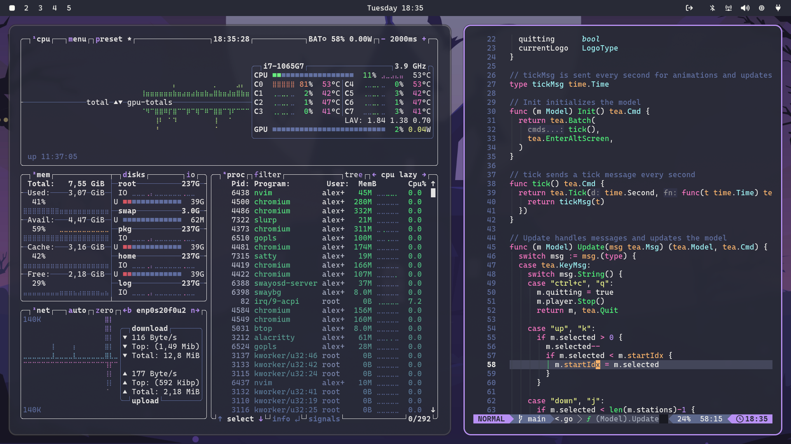
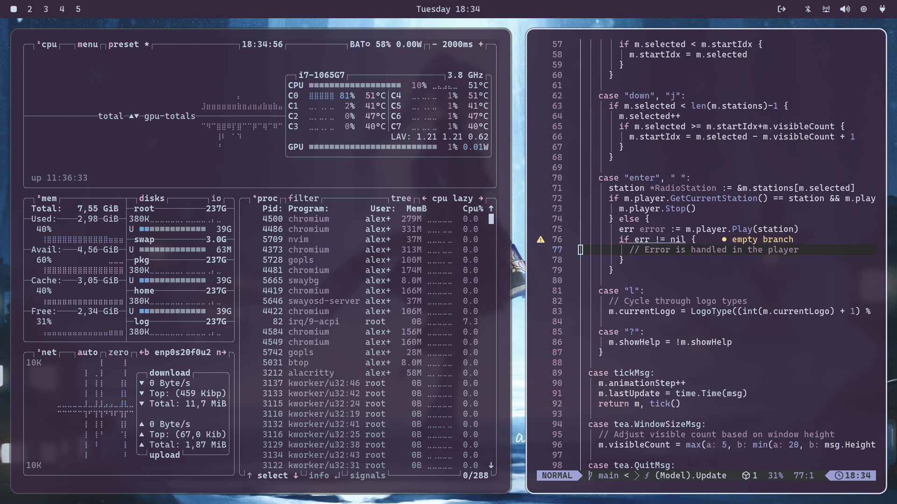

# Omarchy Themes

A collection of themes for Omarchy, including Monokai, Dracula, and Ayaka.

## Themes

- [Monokai](#omarchy-monokai-theme)
- [Dracula](#omarchy-dracula-theme)
- [Ayaka](#omarchy-ayaka-theme)

## Omarchy Monokai Theme

A vibrant dark theme with a focus on bright, contrasting colors.

## Omarchy Dracula Theme

A dark theme with a distinct purple and pink color palette.

## Omarchy Ayaka Theme

A dark theme inspired by the character Ayaka.

## Installation

You can install any of these themes by copying the GitHub URL and running `omarchy-theme-install [url]` or select `Themes > Install` via the Omarchy TUI.

## Contributing

Feel free to open issues or pull requests if you have suggestions or improvements.

## License

This repository and its themes are open-source and available under the MIT License.